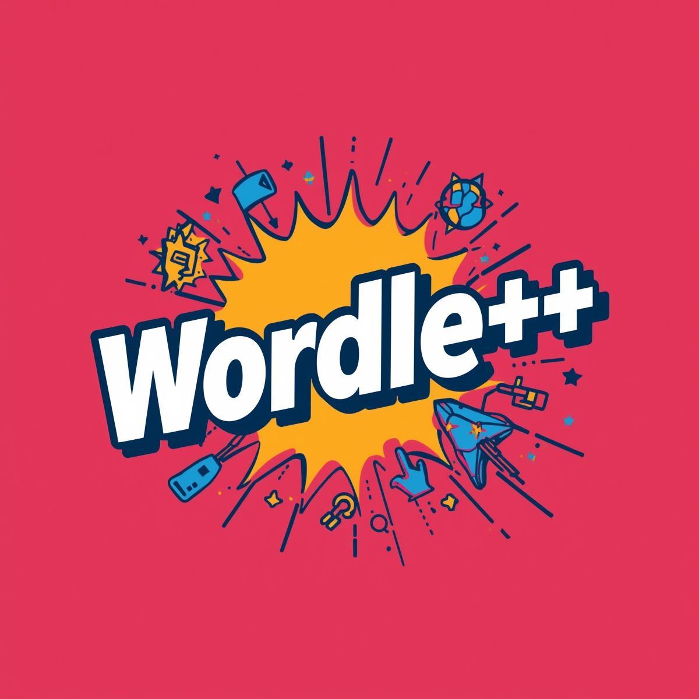

<h1 align="center"> Wordle++ <h1>
 
<div align="center">  </div>
 
## 📋 Table of contents
  - [Description](#description)
  - [Documentation](#docs)
  - [How to run](#install)
  - [Technologies](#technologies)
  - [Collaborators](#collaborators)
<br></br>
## 🔍 Description <a name="description"></a>
<p> 1. Number Wordle
Guess the hidden number within a limited number of attempts, using hints about correct and misplaced digits.
2. Word Wordle
Guess the hidden word within limited number of attempts, using hints about correct and misplaced letters</p>
<br>
 
## 📃 Documentation <a name="docs"></a>
 
### Documentation
 
[ Documentation]()

### Presentation
[Presentation]()
<br></br>
## 🚀 How to run <a name="install"></a>
*The following instructions are going to show you how to set up the project*
 
- Installation
<br></br>
1. Clone the repo:
```
  git clone https://github.com/codingburgas/sprint-math-games-9th-grade-wordle.git
```
 
2. Run with IDE of choice
<br></br>
## 🖥️ Technologies used <a name="technologies"></a>
 
### IDE & version control system:
 
<a href="https://code.visualstudio.com/"></a>
<a href="https://github.com/"></a>
<br></br>
### Programming languages & third-party libraries:
 
</a>
 
<a href="https://cplusplus.com/"> </a>
<br></br>
### Tools used for documantation, presentation & communication:
 
<a href="https://visualstudio.microsoft.com/ru/"></a>
<a href=""></a>
<a href="https://www.microsoft.com/en-us/microsoft-teams/group-chat-software"></a>
<br></br>
<br></br>
## 🧑 Collaborators <a name="collaborators"></a>
- [Nikolay Ivanov](https://github.com/NIIvanov24) - Front-end Developer
- [Filip Filipov](https://github.com/FYFilipov24) - Back-end Developer
- [Todor Neshev](https://github.com/TNNeshev) - Scrum Trainer
- [Yanko Yanev](https://github.com/YAYanev24) - Designer
